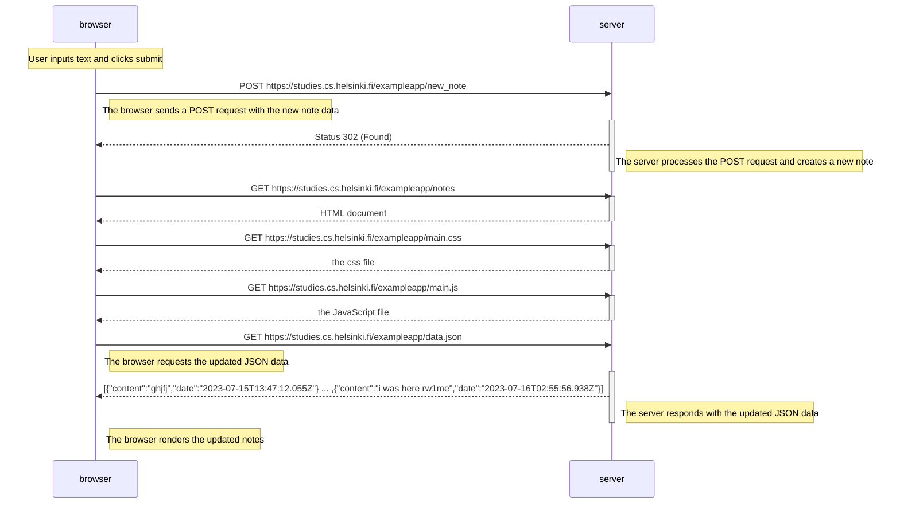

```mermaid 
sequenceDiagram
    participant browser
    participant server

    Note over browser: User inputs text and clicks submit

    browser->>server: POST https://studies.cs.helsinki.fi/exampleapp/new_note
    Note right of browser: The browser sends a POST request with the new note data
    activate server

    server-->>browser: Status 302 (Found)
    Note right of server: The server processes the POST request and creates a new note
    deactivate server

    browser->>server: GET https://studies.cs.helsinki.fi/exampleapp/notes
    activate server
    server-->>browser: HTML document
    deactivate server

    browser->>server: GET https://studies.cs.helsinki.fi/exampleapp/main.css
    activate server
    server-->>browser: the css file
    deactivate server

    browser->>server: GET https://studies.cs.helsinki.fi/exampleapp/main.js
    activate server
    server-->>browser: the JavaScript file
    deactivate server

    browser->>server: GET https://studies.cs.helsinki.fi/exampleapp/data.json
    Note right of browser: The browser requests the updated JSON data
    activate server

    server-->>browser:[{"content":"ghjfj","date":"2023-07-15T13:47:12.055Z"} ... ,{"content":"i was here rw1me","date":"2023-07-16T02:55:56.938Z"}]
    Note right of server: The server responds with the updated JSON data
    deactivate server

    Note right of browser: The browser renders the updated notes
```