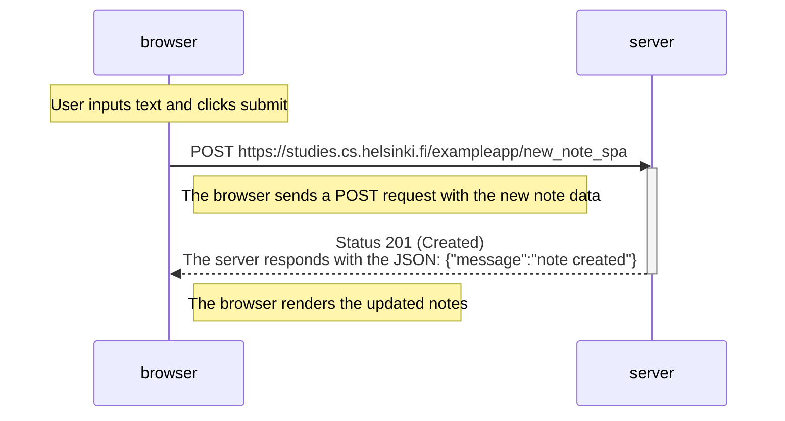

```mermaid
sequenceDiagram
    participant browser
    participant server

    Note over browser: User inputs text and clicks submit

    browser->>server: POST https://studies.cs.helsinki.fi/exampleapp/new_note_spa
    activate server
    Note right of browser: The browser sends a POST request with the new note data

    server-->>browser: Status 201 (Created) <br/> The server responds with the JSON: {"message":"note created"}
    deactivate server

    Note right of browser: The browser renders the updated notes
```